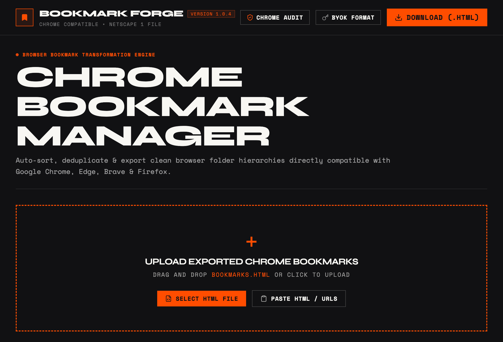

<div align="center">
  
</div>

# Bookmark Forge

Organize a messy Chrome bookmark export into a clean, navigable folder structure. Bookmark Forge removes duplicates, cleans titles, strips tracking parameters, and groups links into useful categories before exporting a Chrome-compatible HTML file.

## Product Overview

Bookmark Forge is a browser-based bookmark organization tool designed for people whose bookmarks have outgrown the default browser folder structure.

## Why Bookmark Forge?

I built Bookmark Forge after running into a problem with my own browser bookmarks. Over the years, I had saved hundreds of links, and the collection had become difficult to understand and maintain. Sorting everything manually was slow and tedious, especially when I wanted to keep useful links while removing duplicates and avoiding accidental loss.

I tried to solve this by creating a tool that could organize bookmarks into categories, identify duplicates, clean up the collection, and show me an overview of what I had saved. I also wanted the process to be reviewable before exporting anything, so the original bookmarks could be checked and preserved rather than changed blindly.

This is my approach to a problem that many people may have when their bookmarks grow over several years. It is very much open to public review, improvement, and new ideas. If you find an issue, have a better workflow in mind, or see a feature that would make bookmark organization more useful, please share it through the [GitHub Issues](https://github.com/Justinjdaniel/chrome-bookmark-organizer-TinyToys/issues) page.

### Key capabilities

- Import Chrome and Netscape-format bookmark HTML files.
- Remove duplicate bookmarks and clean up bookmark titles.
- Strip common tracking parameters from bookmark URLs.
- Organize bookmarks into categories and optional subfolders.
- Review the proposed structure in summary, tree, list, and comparison views.
- Edit, delete, and move bookmarks before exporting.
- Export a Chrome-compatible Netscape bookmark HTML file.
- Optionally use Gemini for AI-assisted categorization with your own API key.

## Typical Workflow

1. Export bookmarks from Chrome as an HTML file.
2. Upload the file to Bookmark Forge, or start with the included sample data.
3. Review the generated summary and folder structure.
4. Adjust organization options or make individual bookmark edits.
5. Optionally run AI categorization with a configured Gemini key.
6. Export the organized HTML file and import it back into Chrome.

## Privacy and Data Handling

Bookmark Forge is designed for static, client-side deployment:

- Bookmark files are processed in the browser.
- No application server is required for the primary organization workflow.
- Gemini access uses a Bring Your Own Key (BYOK) model.
- The Gemini key is stored in browser local storage when configured.
- When AI categorization is enabled, requests are sent directly from the browser to Google AI Studio.

Do not configure a key in a shared or untrusted browser profile. Review your Google AI Studio account and API terms before using AI categorization with sensitive bookmark data.

## Getting Started

### Requirements

- Node.js 18 or later
- pnpm, npm, or another Node package manager
- A modern browser such as Chrome, Edge, Firefox, or Safari

### Install and run

```bash
pnpm install
pnpm dev
```

Open the local URL printed by Vite. The app loads sample bookmarks by default so the interface can be explored immediately.

### Configure AI categorization

1. Open **BYOK Settings** in the top navigation.
2. Enter a Gemini API key from Google AI Studio.
3. Select the model and enable BYOK.
4. Run AI categorization from the organizer controls.

AI categorization is optional. The standard rule-based organizer works without an API key.

## Production Build and Deployment

Build the production bundle with:

```bash
pnpm build
```

The generated `dist` directory is self-contained and can be deployed to any static hosting provider, including Vercel, Netlify, GitHub Pages, or an object-storage website host.

For a local production preview:

```bash
pnpm preview
```

## Available Scripts

| Script              | Purpose                                            |
| ------------------- | -------------------------------------------------- |
| `pnpm dev`          | Start the Vite development server                  |
| `pnpm build`        | Create the production bundle                       |
| `pnpm preview`      | Preview the production bundle locally              |
| `pnpm typecheck`    | Run the TypeScript compiler without emitting files |
| `pnpm lint:check`   | Check source files with ESLint                     |
| `pnpm format:check` | Verify project formatting                          |

## Project Structure

```text
src/
├── components/       UI views and workflow components
├── data/             Sample bookmark data
├── types/            Shared TypeScript types
├── utils/            Parsing, categorization, export, and AI utilities
├── App.tsx           Application state and primary workflow
└── main.tsx          Application entry point
```

## Technical Notes

- The importer and exporter use the Netscape bookmark HTML format supported by Chrome.
- The application does not require a database or server API.
- Browser local storage is used for the optional BYOK configuration.
- Large bookmark collections may require additional browser memory during processing and export.
